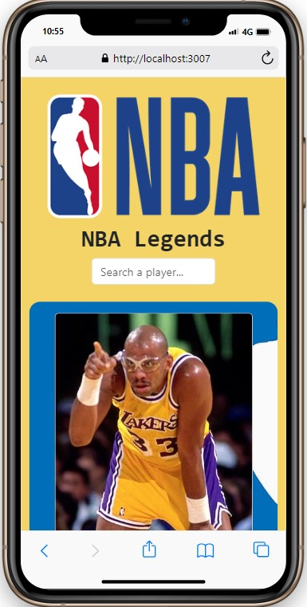
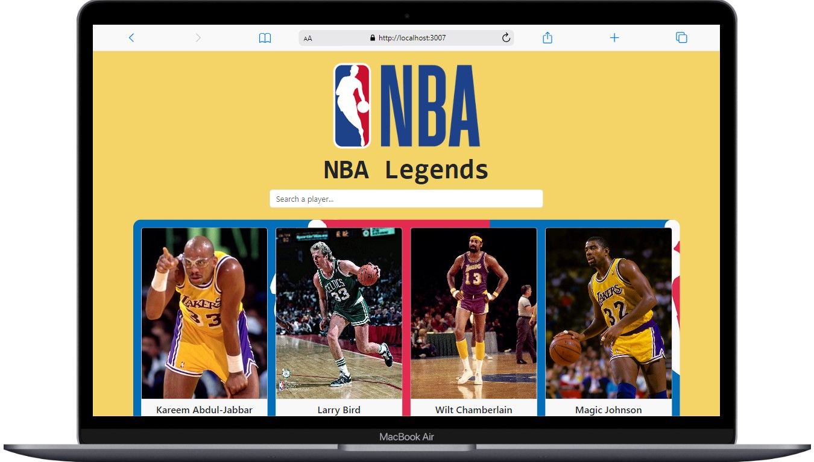

<!-- PROJECT LOGO -->
 

  

  <h3 align="center">L E G E N D S</h3>

  

    We respect them for their strong character and play.
     
    <a href="https://react-nba-legends-app.netlify.app/"><strong> 🏀🏆LIVE »</strong></a>
     
  

<!-- ABOUT THE PROJECT -->
## About The Project

 

That was a nice project that I used components and props structure.
* In this project I filtered the data in the App.jsx file, then under the input field you can see the player based on the searched query  
* [x] useState  
* [x] Responsive  
* [x] useEffect  
* [x] (extra) onMouseLeave : I heard this attribute when work on this project  

## On Mobile 📲

     
     

